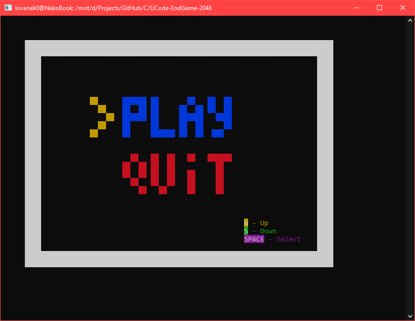
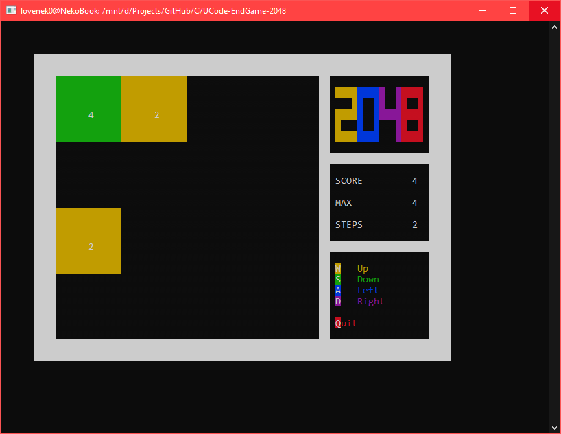
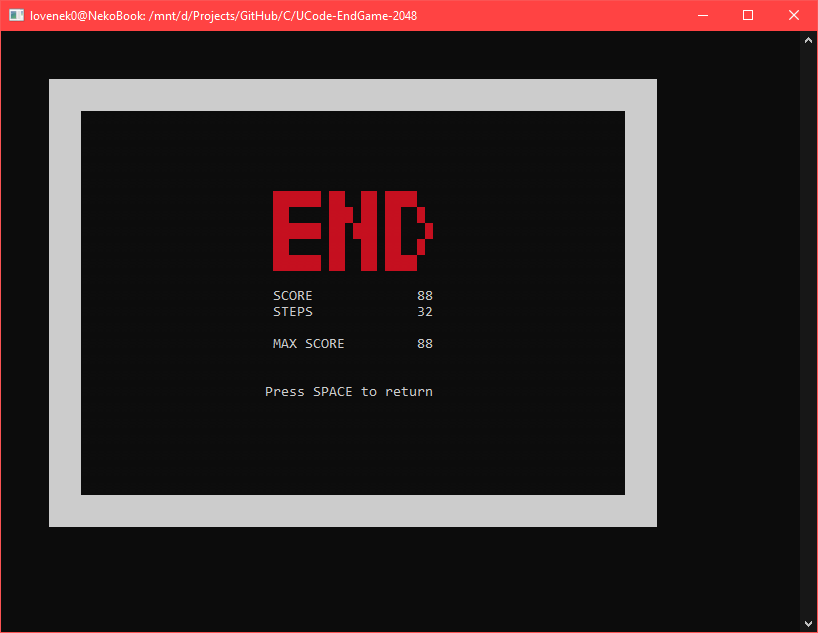
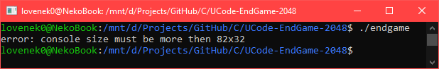

# UCode EndGame 2048

## Intro
- The game was created for the last stage of **UCode-Matathon 2021 - EndGame**.
- The game was rated **100 points by 3 reviewers** and **100 points from Oracle**.
- The presentation was rated at **131 points by 25 participants**.
- Total score: **113**.

Presentation can be found there: [final_presentation.pptx](https://github.com/LoveNek0/UCode-EndGame-2048/releases/download/ncurses-2048-1.0/final_presentation.pptx)

## Authors
- Hennadii Fomin | [LMS](https://lms.ucode.world/users/hfomin) | [GitHub](https://github.com/LoveNek0)
- Iryna Peresada | [LMS](https://lms.ucode.world/users/iperesada) | [GitHub](https://github.com/Irisska)
- Bohdan Huba | [LMS](https://lms.ucode.world/users/bhuba)
- Oleksandr Soldatko | [LMS](https://lms.ucode.world/users/osoldatko)
- Andrii D`Yakonov | [LMS](https://lms.ucode.world/users/adyakonov) | [GitHub](https://github.com/AndriiDiakonov)
- Serhii Volokitin | [LMS](https://lms.ucode.world/users/svolokitin)

## Compiling and Run
1. Before compiling you must install necessary libraries and packages. For that execute command:
    ``` bash
    sudo apt-get install libncurses5-dev libncursesw5-dev clang cmake
    ```
2. Clone repo and go to it`s directory by executing:
    ``` bash
    git clone https://github.com/LoveNek0/UCode-EndGame-2048.git
    cd UCode-EndGame-2048 
    ```
3. For compile you must execute command:
    ``` bash
    make all 
    ```
4. For running execute:
    ``` bash
    ./endgame
    ```
    If after starting the game you see the text `error: console size must be more then 82x32`, then this means that you need to increase the size of the terminal window.

## Gameplay
### Description and Rules
2048 is a game where you combine numbered tiles in order to gain a higher numbered tile. In this game you start with two tiles, the lowest possible number available is two. Then you will play by combining the tiles with the same number to have a tile with the sum of the number on the two tiles.
- In each round, a tile of denomination "2" (with a probability of 90%) or "4" (with a probability of 10%) appears.
- By pressing the arrow, the player can throw off all the tiles of the playing field in one of 4 directions. If, when dropped, two tiles of the same denomination "bump" into one another, then they turn into one, the denomination of which is equal to the sum of the connected tiles. After each move on the free section of the field, a new tile with a face value of "2" or "4" appears. If, when the button is pressed, the location of the tiles or their denomination does not change, then the move is not made.
- If there are more than two tiles of the same denomination in one line or in one column, then when dropped, they begin to connect from the side to which they were directed. For example, tiles (4, 4, 4) in the same row will turn into (8, 4) after the left move, and into (4, 8) after the right move. This processing of ambiguity allows you to more accurately form the strategy of the game.
- For each connection, game points are increased by the face value of the resulting tile.
- The game ends in defeat if after the next move it is impossible to perform an action. 

### Control
- W - Move up
- S - Move down
- A - Move left
- D - Move right
- Q - Quit
- Space/Enter - Select item

### Screenshots




